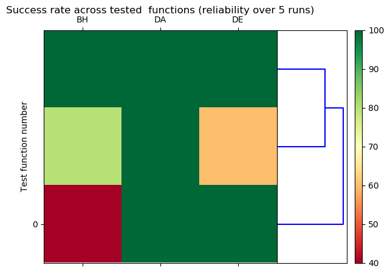

# GOBench

Global Optimization benchmark for python

**Testing functions** used in the benchmark (except suttonchen) have been
implemented by Andreas Gavana, Andrew Nelson and scipy contributors and have
been forked from SciPy project.

Previous results of the benchmarks of sdaopt (using 3 points for numerical
derivatives gradient computation for the local search) available at:
https://gist.github.com/sgubianpm/7d55f8d3ba5c9de4e9f0f1ffff1aa6cf

Minimum requirements to run the benchmarks is to have scipy installed.
Other dependencies are managed in the setup.py file.
Running the benchmark is very CPU intensive and requires a multicore machine
or a cluster infrastructure.

By default, the benchmark includes basinhopping, differential evolution, brute
force, dual annealing (under PR review) from SciPy and pyswarm, cma-es non
scipy optimizers.
CMA (and the restart version, see below) runs slower compare to the scipy
optimizers and will increase benchmark duration.

Note the nlopt optimizers require additional installation/compilation but can
also be benchmarked.

## Installation from source

```bash
git clone https://github.com/sgubianpm/GOBench.git
cd GoBench
# Activate your appropriate python virtual environment if needed
python setup.py install
```

## How to run the benchmark

In order to run the benchmark only on few functions and few methods (will use
the cores available on your machine), run the example below:

```bash
gobench --nb-runs 5 --methods 'BH,DE,DA' --function 'Ackley01,Rosenbrock,Rastrigin'
```

```bash
gobench --help
```

```
usage: gobench [-h] [--nb-runs NB_RUNS] [--output-folder OUTPUT_FOLDER]
               [--functions FUNCTIONS] [--methods METHODS]

Running benchmark and processing results

optional arguments:
  -h, --help            show this help message and exit

  --nb-runs NB_RUNS
        Number of runs for a given function to test by an algorithm.
        Each run will have a different seed value so that the initial
        coordinates will be a different random location.
        Default value is 100 runs.

  --output-folder OUTPUT_FOLDER
        Folder where data file for optimization results are stored.
        Default will create a DATA folder in the working directory.
        Note: Using default will make the benchmark running for a long time,
        better to use a cluster infrastructure.

  --functions FUNCTIONS

        Comma separated names of function to be used in the benchmark.
        By default, all testing functions from SciPy benchmark are used.
        Note: Using default will make the benchmark running for a long time,
        better to use a cluster infrastructure.

  --methods METHODS
        Comma separated names of methods to be benchmarked.
        'DA' for dual annealing
        'BH' for basinhopping
        'DE' for differential evolution
        'DE-R' for differential evolution restart version
        'PSO' for particule swarm
        'PSO-R' for particule swarm restart version
        'BF' for for brute force
        'CMA' for Cov. matrix adaptation evolution strategy
        'CMA-R' for Cov. matrix adaptation evolution strategy restart version
```


## How to generate the report

Use the `goreport` tool that generates either csv file, heatmap reliability
figure of average number of function calls (in pdf, png, svg or eps formats
depending of provided out file extention).

```bash
goreport --help
```

```
usage: goreport [-h] [--results-folder RESULTS_FOLDER] [--out OUTPUT_FILEPATH]
                [--type RESULT_TYPE]

Generate reports with benchmark results

optional arguments:
  -h, --help            show this help message and exit
  --results-folder RESULTS_FOLDER

        Folder where data file for optimization results are stored.

  --out OUTPUT_FILEPATH

        Path for the figure file to be generated. The given file extention
        will set the file format to be generated (pdf, png, svg, eps or csv
        for tabular results)

  --type RESULT_TYPE
        Type of report to be generated. Possible reports are for now:
        heatmap, csv.
```


### A csv file report
```bash
goreport --type csv --out results.csv
```

will produce a csv file that looks like:

### A reliability heatmap
```bash
goreport --type heatmap --out heatmap.png
```

will produce a figure looking like below:



## Running benchmark on a multicore machine

```bash
# Activate your appropriate python virtual environment if needed
# Replace NB_RUNS by your values (default value is 100)
# NB_RUNS is the number of runs done for each testing function and algorithm used
# The script uses all available cores on the machine.
gobench --nb-runs NB_RUNS --output-folder OUTPUT_FOLDER

```

## Running benchmark on a cluster (Example for Moab/TORQUE)

The total number of testing functions is 261. The benchmark can be parallelized
on 261 cores of the cluster infrastructure, the benchmarks are embarassingly
parallel. If you cluster nodes have 16 cores, 17 sections will be required for
splitting the processing (_261 / 16 = 16.3125, so 17 sections_)

Below a script content example for Maob/TORQUE:
```bash
#!/bin/bash
# Replace OUTPUT_FOLDER by your the path of your choice
# Adjust YOUR_PYTHON_VIRTUAL_ENV and YOUR_SDAOPT_GIT_FOLDER
##### These lines are for Moab
#MSUB -l procs=16
#MSUB -q YOUR_QUEUE_NAME_FOR_LONG_JOBS
#MSUB -o OUTPUT_FOLDER/bench.out
#MSUB -e OUTPUT_FOLDER/bench.err
source YOUR_PYTHON_VIRTUAL_ENV/bin/activate
gobench --nb-runs 100 --output-folder OUTPUT_FOLDER
```
On your machine that is able to submit jobs to the cluster
```bash
for i in {0..16}
    do
        msub -v USE_CLUSTER,NB_CORES=16,SECTION_NUM=$i benchmark-cluster.sh
    done
```
